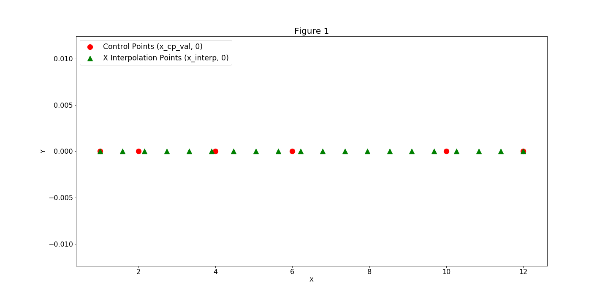
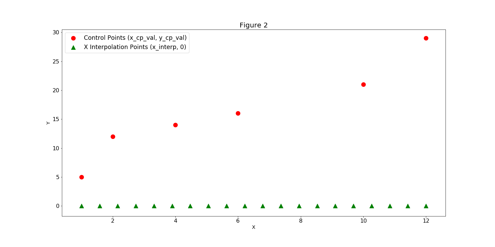
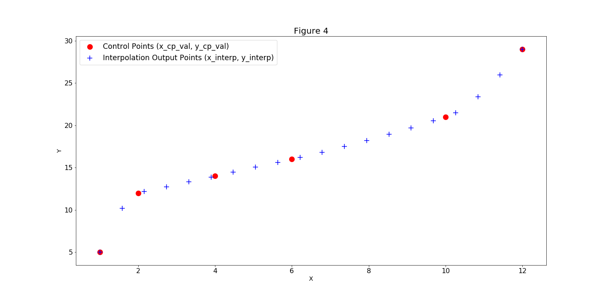

POEM ID:  004  
Title:   Creating Interpolant Class For 1D Splines  
authors: [DKilkenny]  
Competing POEMs: [N/A]  
Related POEMs: [N/A]  
Associated Implementation PR:

Status:

- [x] Active
- [ ] Requesting decision
- [ ] Accepted
- [ ] Rejected
- [ ] Integrated


Motivation
==========

Community feedback on spline component usage from Garett Barter (NREL) and Andrew Ning (BYU) highlighted a few shortcomings of the current implementation.

* The current implementation requires a user to create a different Component for each interpolator even if they use the same control points and interpolated point locations.
* The API between the two currently implemented spline components (`AkimaSplineComp`, `BsplineComp`) significantly diverges.
* The interpolation algorithms should be available for standalone use.
* The interpolator implementations in the spline components (in particular Akima) are separate from those in the StructuredMetaModel Component and should be combined to eliminate code duplication.

Please see the reference section for links to the current implementation.

Description
===========

This POEM seeks to integrate `AkimaSplineComp` and `BsplineComp` into a single spline component with an API that is consistent with the two meta model components ([StructuredMetaModel](http://openmdao.org/twodocs/versions/2.9.1/features/building_blocks/components/metamodelstructured_comp.html),  [UnstructuredMetaModel](http://openmdao.org/twodocs/versions/2.9.1/features/building_blocks/components/metamodelunstructured_comp.html) as of 2.9.1). Additionally, it will also unify the underlying interpolation routines between `AkimaSplineComp` and `StructuredMetaModel` and define an API for them to be used independently of the components themselves. 

The fundamental difference between the proposed `SplineComp` and the existing `StructuredMetaModelComp` are as follows:

* `StructuredMetaModel` is used when the user has a known set of x and y training points on a structured grid and wants to interpolate a new y value at a new x location that lies between those points. For this component, the user needs an array of training points for each input and output dimension; generally, these remain constant. `StructuredMetaModel` can be used for multi-dimensional design spaces, whereas `SplineComp` is restricted to one input.

* `SplineComp` is used when a user wants to interpolate to a large array of values from a small array of control points. The smaller control points are defined by their x and y values. Typically, the x location of the control points and the interpolated points are known a priori, and the y value at the interpolated point is calculated for each new y at the control point. 

With these difference in mind, we crafted the new SplineComp API to have a similar workflow to the StructuredMetaModel Component. 

SplineComp API
--------------------
```
class SplineComp(ExplicitComponent):

    def __init__(self, method, x_cp_val, x_interp, x_cp_name='x_cp', x_interp_name='x_interp',
                 x_units=None, vec_size=1, interp_options={}):
        """
        Initialize all attributes.

        Parameters
        ----------
        method : str
            Interpolation method. Valid values are ['akima', 'bspline', (more to come)]
        x_cp_val : list or ndarray
            List/array of x control point values, must be monotonically increasing.
        x_interp : list or ndarray
            List/array of x interpolated point values.
        x_cp_name : str
            Name for the x control points input.
        x_interp_name : str
            Name of the x interpolated points input.
        x_units : str or None
            Units of the x variable.
        vec_size : int
            The number of independent splines to interpolate.
        num_cp : int
            Number of points to interpolate at
        interp_options : dict
            Dict contains the name and value of options specific to the chosen interpolation method.
        """
```

```
    def add_spline(self, y_cp_name, y_interp_name, y_cp_val=None, y_units=None):
        """
        Add a single spline output to this component.

        Parameters
        ----------
        y_cp_name : str
            Name for the y control points input.
        y_interp_name : str
            Name of the y interpolated points output.
        y_cp_val : list or ndarray
            List/array of default y control point values.
        y_units : str or None
            Units of the y variable.
        """
```

Example Usage of SplineComp API
---------------------------------

In our example, we have a pre-generated curve that is described by `x_cp` and `y_cp` below which we interpolate between. We also have pre-generated points to interpolate at, which in our case is: `x`. To set the x position of control and interpolation points in `SplineComp` we pass `x_cp` and `x` into their respective contstructor arguments (Figure 1). Next we'll add our `y_cp` data in by calling the `add_spline` method and passing `y_cp` into the argument `y_cp_val` (Figure 2). `SplineComp` calculates the `y_interp` values and gives the output of interpolated points (Figure 3).

**Single Spline Example of Proposed API**
```
    # Data
    x_cp = np.array([1.0, 2.0, 4.0, 6.0, 10.0, 12.0])
    y_cp = np.array([5.0, 12.0, 14.0, 16.0, 21.0, 29.0])
    x = np.linspace(1.0, 12.0, 20)

    prob = om.Problem()

    comp = om.SplineComp(method='akima', x_cp_val=x_cp, x_interp_val=x)
    prob.model.add_subsystem('akima1', comp)

    comp.add_spline(y_cp_name='ycp', y_interp_name='y_val', y_cp_val=y_cp)

    y_interp = prob['akima1.y_val']
```




 

 

 

Further Examples
----------------
Next are a few examples of what the proposed API looks like for a few specific cases:

**Multiple Splines, One Interpolant Method**  
Each spline you add will use the same `x_cp_val`, `x_interp`, and `method` arguments.  
```
    x_cp = np.array([1.0, 2.0, 4.0, 6.0, 10.0, 12.0])
    y_cp = np.array([5.0, 12.0, 14.0, 16.0, 21.0, 29.0])
    y_cp2 = np.array([1.0, 5.0, 7.0, 8.0, 13.0, 16.0])
    x = np.linspace(1.0, 12.0, 50)

    prob = om.Problem()

    comp = om.SplineComp(method='akima', x_cp_val=x_cp, x_interp=x, x_interp_name='x_val')
    prob.model.add_subsystem('akima_component', comp)

    comp.add_spline(y_cp_name='ycp1', y_interp_name='y_val1', y_cp_val=y_cp)
    comp.add_spline(y_cp_name='ycp2', y_interp_name='y_val2', y_cp_val=y_cp2)

    y_interp = prob['akima_component.y_val1']
```

**Basic Bspline Example**  
Each spline you add will use the same `x_cp_val`, `x_interp`, and `method` arguments.  
```
    n_cp = 80
    n_point = 160

    t = np.linspace(0, 3.0*np.pi, n_cp)
    tt = np.linspace(0, 3.0*np.pi, n_point)
    x = np.sin(t)

    prob = om.Problem()

    bspline_options = {'order': 4}
    comp = om.SplineComp(method='bsplines', x_interp_val=tt, num_cp=n_cp,
                         interp_options=bspline_options)
    prob.model.add_subsystem('interp', comp)

    comp.add_spline(y_cp_name='h_cp', y_interp_name='h', y_cp_val=x, y_units='km')

    xx = prob['interp.h']
```

**Passing Optional Arguments To Akima**  
In this example we are passing in `delta_x` and `eps` which are specific to the akima method.
```
    x_cp = np.array([1.0, 2.0, 4.0, 6.0, 10.0, 12.0])
    y_cp = np.array([5.0, 12.0, 14.0, 16.0, 21.0, 29.0])
    x = np.linspace(1.0, 12.0, 50)

    prob = om.Problem()

    akima_option = {'delta_x': 0.2, 'eps': 1e-30}
    comp = om.SplineComp(method='akima', x_cp_val=x_cp, x_interp=x, x_cp_name='xcp', 
                         x_interp_name='x_val',  x_units='km', interp_options=akima_options)

    prob.model.add_subsystem('atmosphere', comp)

    comp.add_spline(y_cp_name='alt_cp', y_interp_name='alt', y_cp_val=y_cp, y_units='kft')

    y_interp = prob['atmosphere.alt']
```

**Non-uniform Distributions Example**
```
    from openmdao.utils.spline_distributions import cell_centered, node_centered, sine_distribution
    x_cp = np.array([1.0, 2.0, 4.0, 6.0, 10.0, 12.0])
    y_cp = np.array([5.0, 12.0, 14.0, 16.0, 21.0, 29.0])

    x_cell_centered = cell_centered(20, start=1, stop=12)
    x_node_centered = node_centered(20, start=1, stop=12)
    x_sin_dist = sine_distribution(20, start=1, stop=12, phase=np.pi)

    prob = om.Problem()

    comp1 = om.SplineComp(method='akima', x_cp_val=x_cp, x_interp=x_cell_centered)
    comp2 = om.SplineComp(method='akima', x_cp_val=x_cp, x_interp=x_node_centered)
    comp3 = om.SplineComp(method='akima', x_cp_val=x_cp, x_interp=x_sin_dist)

    prob.model.add_subsystem('akima1', comp1)
    prob.model.add_subsystem('akima2', comp2)
    prob.model.add_subsystem('akima3', comp3)

    comp1.add_spline(y_cp_name='ycp', y_interp_name='y_val', y_cp_val=y_cp)
    comp2.add_spline(y_cp_name='ycp', y_interp_name='y_val', y_cp_val=y_cp)
    comp3.add_spline(y_cp_name='ycp', y_interp_name='y_val', y_cp_val=y_cp)
```

Standalone Usage of The Interpolants
------------------------------------

We also propose a functional standalone interface for directly using any of the interpolants. 
```
    class InterpND(values, points=None, interp_method="slinear", x_interp=None, bounds_error=True,
                   **kwargs):
        """
        Initialize instance of interpolation class.

        Parameters
        ----------
        values : array_like, shape (m1, ..., mn, ...)
            The data on the regular grid in n dimensions.
        points : tuple of ndarray of float, with shapes (m1, ), ..., (mn, )
            The points defining the regular grid in n dimensions.
        interp_method : str or list of str, optional
            Name of interpolation method(s).
        x_interp : ndarry or None
            If we are always interpolating at a fixed set of increasing locations, then that can be
            specified here.
        bounds_error : bool, optional
            If True, when interpolated values are requested outside of the domain of the input
            data, a ValueError is raised. If False, then the methods are allowed to extrapolate.
            Default is True (raise an exception).
        **kwargs : dict
            Interpolator-specific options to pass onward.
        """
```
This simple standalone function is intended to be used for standard interpolation (`StructuredMetaModel`), including for multidimensional data sets, and for constructing a higher dimension curve from a low dimensional representation (`SplineComp`), as we use the spline components.

Usage looks like this where we want to compute new y for new x: 
```
    akima_options = {'delta_x': 0.1}
    interp = InterpND(values=ycp, points=xcp, interp_method='akima', x_interp=x,
                      bounds_error=True, **akima_options)
    y = interp.evaluate_spline(np.expand_dims(ycp, axis=0))
```

API Changes From 2.9.1
------------------------------------------

Deprecation of `AkimaSplineComp` and `BsplineComp` and replacement with unified `SplineComp`. 


In the new SplineComp, the following options are not preserved: 
* `distribution` from BsplinesComp
* `eval_at` from AkimaSplineComp

These options are being removed in favor of requiring the user to specify the x locations of the control point and interpolated points. 
We will provide helper functions for the common uses cases (e.g. cell-centered, node-centered, sine/cosine distributions)

Renaming StructuredMetaModel
-----------------------------

We are considering changing the name of `StructuredMetaModelComp` to `InterpNdComp` (or `InterpolationNDComp`) to differentiate it from `UnstructuredMetaModelComp`.

References
-----------
1. http://openmdao.org/twodocs/versions/2.9.1/features/building_blocks/components/akima_spline_comp.html
2. http://openmdao.org/twodocs/versions/2.9.1/features/building_blocks/components/bsplines_comp.html


